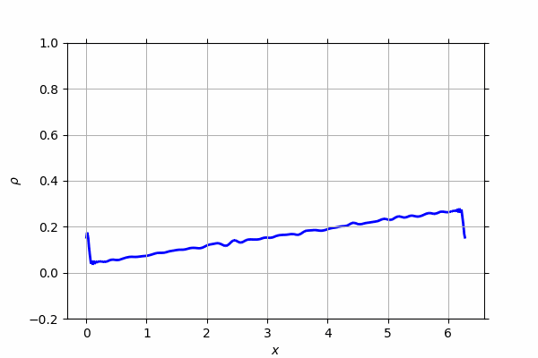
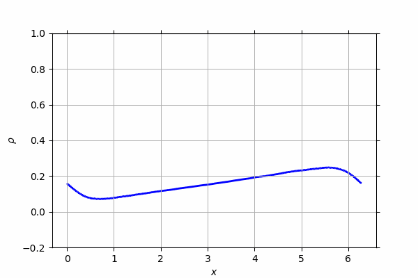
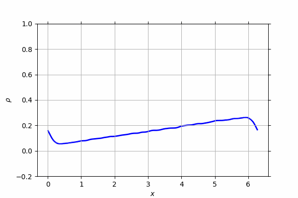
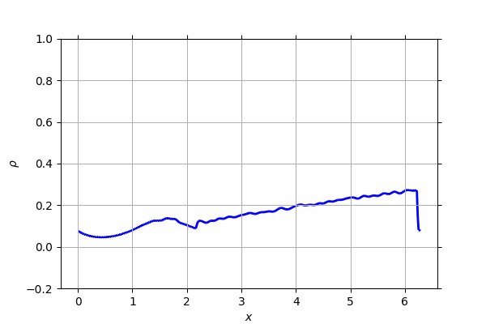
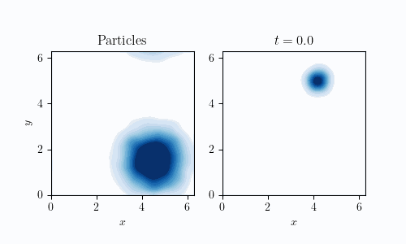
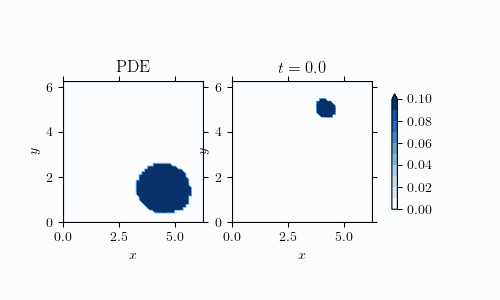

# Regularised Inertial Dean Kawasaki
# Firedrake (RIDK-FD)

This repo contains the Python code used in 

    THE REGULARISED INERTIAL DEAN–KAWASAKI EQUATION:
    DISCONTINUOUS GALERKIN APPROXIMATION AND MODELLING
    FOR LOW-DENSITY REGIME; F. Cornalba & T. Shardlow

RIDK is a stochastic partial differential equation (SPDE) arising in the fluctuating hydrodynamics of intertial particles. RIDK-FD is a Python implementation for numerically simulating RIDK. It uses a discontinuous Galerkin approximation-in-space and semi-implicit Euler-Maruyama approximation-in-time. The main functionality for discontinuous Galerkin is provided by [Firedrake](https://firedrakeproject.org/).

### Contents

- RIDK.py: library of common routines used to implement RIDK solver.
- RIDK-DG-1d.py and RIDK-DG-1d_interact.py: examples in 1d (with and without reacting particles).
- RIDK-DG-2d.py and RIDK-DG-2d_interact.py: examples in 2d (with and without reacting particles).
- particle_model_Sec7/: implementation of the particle model given in Section 7. See run.py to generate data and output*.py to generate plots and animations.

## RIDK animations in 1d

Here's some animations corresponding to plots in the paper.

### Unregularised one-dimensional RIDK (Fig 1)

### High diffusion regularisation (Fig 2)

### Low diffusion regularisation (Fig 3)

### Time-scale regularisation (Fig 4)

## Animations in 2d 

Here's some animations corresponding to the reaction/diffusion example in Section 7.

### Particle model

### RIDK simulation (unregularised)

The orange regions indicate negative density ($\rho<0$).

### RIDK simulation (regularised)

